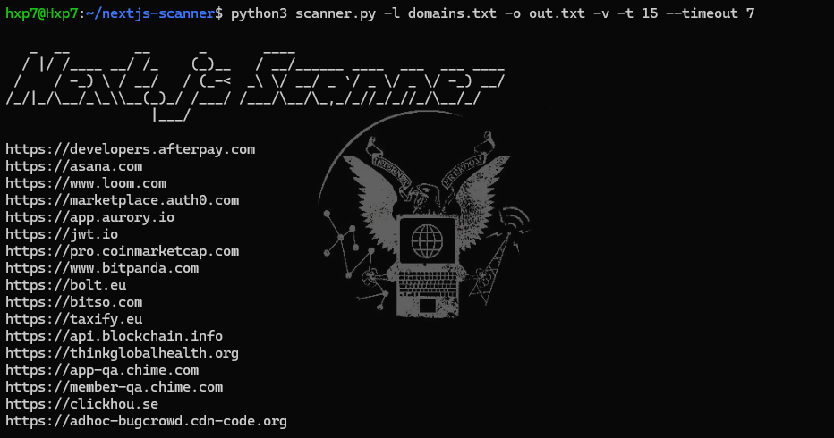

# NextJS-Scanner

A fast, threaded Next.js detection tool that checks domains for server response headers commonly used by Next.js deployments.

This tool is especially useful for **bug bounty / security research workflows** where you want to:
- Identify targets that use **Next.js**
- Later scan those confirmed Next.js targets with **React2Shell** scanner

---

# Features

- **Next.js Header Detection**  
  Detects known Next.js/Vercel headers such as:
  - `x-powered-by: next.js`
  - `x-nextjs-page`
  - `x-matched-path`
  - `x-vercel-id`
  - `x-nextjs-cache`
  - `x-nextjs-stale-time`

- **Threaded Scanning**  
  Faster enumeration with configurable threads (`-t`).

- **Real-Time Output**  
  Writes results to the output file **immediately**, not after completion.

- **Supports Domain List or Single URL**  
  Use `-l` for lists or `-u` for a specific target.



---

# Installation

```bash
git clone https://github.com/hxp7th/nextjs-scanner
cd nextjs-scanner
pip install requests
```

# Usage

- **Scan a domain list**
```python3 scanner.py -l domains.txt -o results.txt```

- **Scan a single target**
```python3 scanner.py -u https://example.com -o results.txt```

- **Enable verbose output**
```python3 scanner.py -l domains.txt -o results.txt -v```

- **Increase threads**
```python3 scanner.py -l domains.txt -o results.txt -t 50```

- **Change timeout**
```python3 scanner.py -l domains.txt -o results.txt --timeout 5```

# Options

| Flag | Description |
|------|-------------|
| `-l`   | Domain list file |
| `-u`   | Single target |
| `-o`   | Output file |
| `-t`   | Threads |
| `-v`   | Verbose |
| `--timeout` | Request timeout |


# Output

The output file contains only the domains that were detected as using Next.js, one per line:
```
https://example.com
https://another-site.com
```

You can then pipe or feed this list directly into other tools


# Example `domains.txt`
```
example.com
vercel.com
nextjs.org
github.com
```

# License

MIT License.


# Contribution

Pull requests are welcome.

If you have suggestions (JSON output, banner mode, fingerprinting Next.js versions, tighter heuristics for react2shell targeting, etc.), feel free to open an issue.
